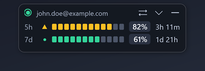
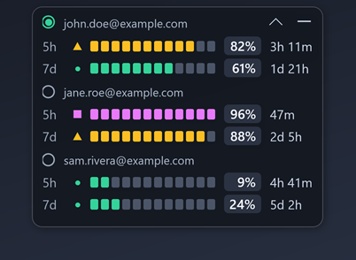
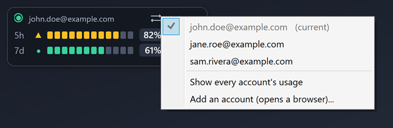
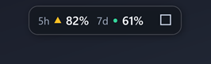
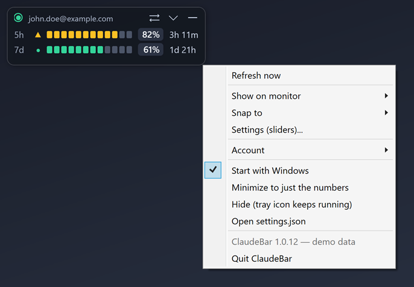

# ClaudeBar

A small always-on-top panel for Windows 11 that sits above the clock and shows how much of
your Claude Code usage limit is gone — and lets you switch between Anthropic accounts with
one click when one of them runs out.



The numbers are the real ones — the same figure Claude Code's own `/usage` reports — not an
estimate from transcripts.

## What it does

- **Shows the 5-hour and 7-day windows** for the signed-in account, with the time until each
  resets. Refreshes every minute.
- **Warns before the wall.** Amber at 80%, magenta at 90%, and a "limit reached" note at
  100% that reminds you to switch. Every state carries a shape and a number as well as a
  colour, so it works if you're red/green colour blind.
- **Switches accounts without a browser.** Click `⇄` and pick one. Every running Claude Code
  terminal follows, exactly as `/login` would — but without the browser round trip.
- **Shows every account at once** (`▾`) so you can see which one has headroom before you
  switch. In that view the radio buttons *are* the switcher.
- **Learns accounts automatically.** Sign in however you like — `/login` in a terminal,
  `claude auth login`, or the menu's *Add an account* — and ClaudeBar notices within a second
  and remembers it. No extra step.
- **Stays out of the way.** Minimize (`–`) to a single line of numbers, or hide it entirely
  and read the percentage off the tray icon — it draws the number: the 5-hour one, since that
  is the window you are spending. Hovering it shows both, and the colour still follows
  whichever window is closest to its ceiling. Snaps to any screen edge or corner on any
  monitor, remembers where you put it, starts with Windows if you want.

Every account at once (`▾`) — one is nearly out, one has a week's headroom, and the radio
buttons switch:



The switcher (`⇄`), and the mini layout (`–`), which is the whole thing when you just want
the numbers:





Everything else is on the right-click menu:



(The accounts in these screenshots are invented — they come from `ClaudeBar.exe --demo`.)

## Install

Download `ClaudeBar_v1.0.<n>.exe` from the [latest release](../../releases) and run it. It is a
single self-contained file; nothing else to install. Right-click → *Start with Windows* to keep
it. The version it is running is at the bottom of that same right-click menu.

Requires Claude Code to be installed and signed in with a Claude subscription. If it isn't,
ClaudeBar says so rather than crashing.

## Using it

| Action | How |
| --- | --- |
| Switch account | click `⇄`, or in the all-accounts view click an account's `○` |
| Show all accounts / just the active one | click `▾` / `▴` |
| Minimize to one line | click `–`; click `☐` on the mini pill to restore |
| Move it | drag; it snaps to edges and corners, with a ghost showing where it will land |
| Everything else | right-click: monitor, snap position, sliders, hide, autostart, quit |

Settings (opacity, snap padding, poll interval, warning thresholds) are sliders under
right-click → *Settings*, and live in a plain `settings.json` next to the exe.

## How switching works, and what it touches

Claude Code keeps its sign-in in `~/.claude/.credentials.json`, and every running `claude`
process re-reads that file when its token expires. That is why `/login` in one terminal
already switches all of them. ClaudeBar does the same thing by writing that file — after
backing it up, and verifying afterwards with `claude auth status` that the right account
came back. If verification fails it restores the backup.

ClaudeBar keeps its own copy of each account's sign-in under `%LOCALAPPDATA%\ClaudeBar\`,
**encrypted with Windows DPAPI** for your user. Nothing credential-shaped is ever logged,
shown, or sent anywhere except to Anthropic's own endpoints, with your own tokens. The
browser is only ever needed the first time you sign into an account.

The token for an account you are *not* using has to be refreshed occasionally to read its
usage; ClaudeBar does that and stores the result. It never refreshes the token of the account
Claude Code is actively using — that is Claude Code's job, and interfering would sign you
out.

## Building

.NET 10 SDK, Windows.

```bash
cd src/ClaudeBar
dotnet run                          # debug
dotnet run -- --demo                # invented accounts, for screenshots
dotnet publish -c Release -o ../../release   # single self-contained exe
```

`release/` is gitignored; binaries go on the Releases page.

The version is `1.0.<commit count>` — `git rev-list --count HEAD`, stamped in by the csproj at
build time, shown at the bottom of the right-click menu, and used for the release file name.
Nothing to bump by hand.

`--demo` replaces the account store and the usage endpoint with three invented accounts. It
reads no credentials, writes no settings, and cannot switch or sign in to anything; it exists
so the screenshots above can be re-taken by anyone, with `docs/screenshots.ps1`. Add
`--scale=3` and the whole pill is laid out three times bigger — the script shoots that and
resamples it down, which is why the images have smooth edges rather than magnified pixels.

## Colour

Built by and for someone who is red/green colour blind, so no state relies on colour alone
and the palette has no red/green pair: teal `#34D399`, amber `#FBBF24`, magenta `#E879F9`.
Each state also has a glyph (`●` `▲` `■`), a countable 12-segment bar, and the number.
